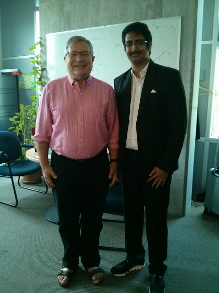

Seven months after getting through the interview I was at the [Kempegowda International Airport](https://en.wikipedia.org/wiki/Kempegowda_International_Airport), ready to leave for a two month long overseas trip to Halifax in Canada.

Getting an internship offer at Dalhousie University was nothing short of a surprise to me. Thanks, to Dr Kavi Mahesh, it was indeed a dream come true. I had been assigned to Dr Stan Matwin, a member of the Canada Research Chair and had to work in the domain of Big Data Analytics.

<blockquote class="twitter-tweet" lang="en">
Visiting CS undergrads from PES university in Bangalore share  their research projects with us today. Great work. <a href="http://t.co/KPyxSyEVur">pic.twitter.com/KPyxSyEVur</a>
&mdash; carolyn watters (@CarolynatDal) <a href="https://twitter.com/CarolynatDal/status/616993403419684864">July 3, 2015</a></blockquote>

