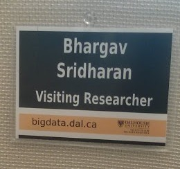
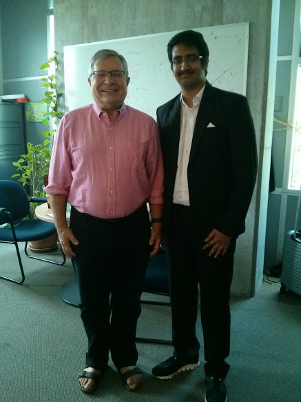

Seven months after getting through the interview, I was at the [Kempegowda International Airport](https://en.wikipedia.org/wiki/Kempegowda_International_Airport), ready to leave for a two month long overseas trip to *Halifax* in Canada. Picking my two filled carry bags and collecting my air tickets I was finally ready for my sojourn in the Capital of Nova Scotia.

Getting an internship offer at Dalhousie University was nothing short of a surprise to me. Thanks, to Prof Kavi Mahesh, it was indeed a dream come true. I had been assigned to Prof Stan Matwin, a member of the Canada Research Chair and had to work in the domain of Big Data Analytics.

After nearly a twenty hour *bumpy* ride with two stops in Frankfurt and Montreal, I finally reached Halifax. Prof Mike Shepherd, the then DEAN of Computer Sciences, took me to Howe Hall, which would be my home for the next 9 weeks.

Canada was exciting from the very first day. I expected to be hit by a huge *Cultural Shock*, fortunately there wasn't much a difference. Prof Shepherd and his team kept me at ease at all times. Raghav Sampangi, a postdoc at Dalhousie, introduced us to the working princicples of the university. Vidhya Mam, (as I fondly called her), introduced me to Prof Stan and the Big Data Lab, the place where I was assigned to work. I was called as ***"Visiting Researcher"***.

The first meeting went off well. I was given a project related to Spatiotemporal Visualization, a field that I loved. The project was to be done using GIS Systems and R Language. As I had ample knowledge in that field, the project was simple to start.

Weekly meetings with all the other professors were also organised. It was to ensure that I was updated with the current on-going projects in the department. They also made me work more so that I meet their expectations. I even had the oppurtunity of meeting Prof Carolyn, the VPA of Dalhousie. She later tweeted about the meet.

<blockquote class="twitter-tweet" lang="en">
Visiting CS undergrads from PES university in Bangalore share  their research projects with us today. Great work. <a href="http://t.co/KPyxSyEVur">pic.twitter.com/KPyxSyEVur</a>
&mdash; carolyn watters (@CarolynatDal) <a href="https://twitter.com/CarolynatDal/status/616993403419684864">July 3, 2015</a></blockquote>

That's me, second from left, in between the Shepherds

The Project started off with a good pace. Projects back home, in PES, did help me a lot while doing this project. The Data was from the Atlantic Canada Oppurtunities Agency and I had to visualize that on the Elections Dataset. It invovled the usage of shapefiles and polygon visualization.

Towards the end of June, I joined Mrs Somayeh Fatahi to visualize sales data. Another interesting project, it involved the depiction of various supermarket stores (like the Atlantic Super Store) across Canada using *ink-drop* visualization.

The last day was a bit hectic. I had a hour long meet with Prof Stan where we discussed the future of the project. It was followed by a conference meet with other professors where I had to demonstate the work that I had done till then. Finally the day ended with a seminar on *Using distributed word vector representation for text classification* by Prof Vera Sazonova. My project at the Big Data Centre was over. I managed to catch hold of my professor for a photograph.

I miss Prof Stan and his cute smile

Overall, the internship at Dalhousie gave me many unforgettable memories. Be it the lectures, interactions with the different professors or speaking with the other staff, all left an indelible impressions on my mind. The stay was a truly memorable one and I will certainly cherish those moments throughout my life. 