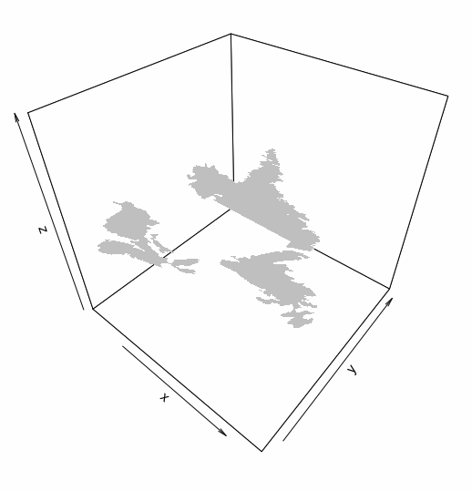

3D Visualization of ESRI Shapefiles in R has always been a difficult process. Not many have tried to visualize geospatial data in 3D. I have utilized [`maptools`](https://cran.r-project.org/web/packages/maptools/index.html) and [`plot3D`](https://cran.r-project.org/web/packages/plot3D/index.html) for the following visualization. So we include the libraries

    library(maptools)
    library(plot3D)

First we use the `readShapeSpatial` function from `maptools` to read the shapefile. Remeber to point it to the `.shp` file. 

    ShapeFile <- readShapeSpatial('Test.shp')

I have used a shapefile of Atlantic Canada in my example below, you can use the same from [here](https://github.com/Bhargav-Rao/Bhargav-Rao.github.io/tree/master/Others/Test)

The `S4` object returned from `readShapeSpatial` contains a slot called `polygon`. This helps us get the co-ordinates to plot the different polygons. 

    Polygons <- slot(ShapeFile,"polygons")

Using `lapply`, we can extract the coordinate values and the Polygon ID from the slot. This is done as follows. 

    temp <- do.call(rbind, lapply(Polygons, function(x) slot(slot(x, "Polygons")[[1]], "coords")))

Now we create a dummy plot

    polygon3D(temp[, 1], temp[, 2], rep(0, nrow(temp)), col="transparent")

Finally we use `polygon3D` to draw the polygons. 

    for (i in seq_along(Polygons)) {
      temp <- slot(slot(Polygons[[i]], "Polygons")[[1]], "coords")
      polygon3D(temp[, 1], temp[, 2], rep(0, nrow(temp)), add = TRUE)
    }

We now have our nice map. 

